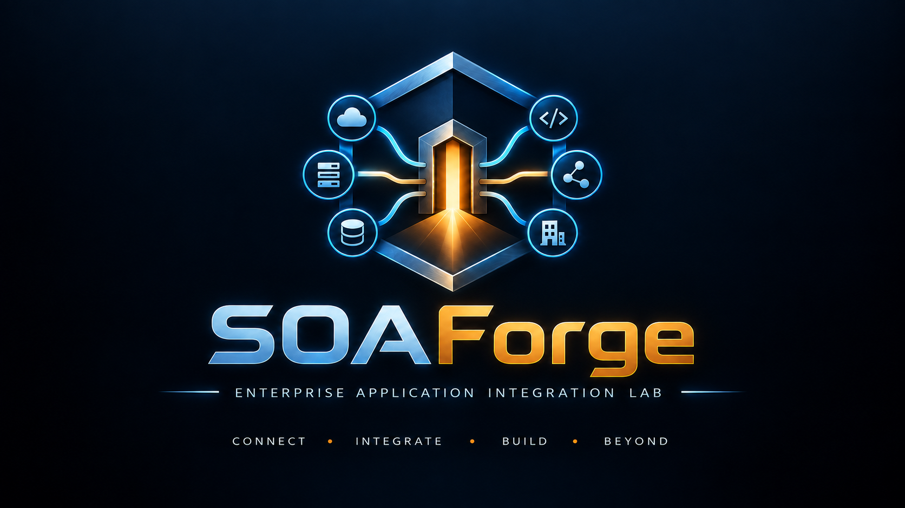

 

  

  

**Enterprise Application Integration Lab**

*SOA · API Management · Governance · Integration · Observability*

## 📌 Descripción

**SOAForge** es el proyecto académico del primer parcial de **Integración de Aplicaciones con Tecnología Propietaria (ISO-810)** en UNAPEC.

El caso asignado al grupo es **Akana SOA**. El repositorio conserva la investigación de la plataforma y una demostración técnica propia para ilustrar conceptos de arquitectura orientada a servicios, contratos, APIs, gateway, políticas, gobierno y observabilidad.

> SOAForge es exclusivamente el proyecto de **ISO-810 / Akana SOA**. Los trabajos de integración con tecnología open source se mantienen en un repositorio independiente.

---

## 🎓 Información académica

| Información | Detalle |
|---|---|
| 🏫 Institución | **Universidad APEC (UNAPEC)** |
| 👨‍🏫 Profesor | **Juan Pablo Valdez Reyes** |
| 📅 Período académico | **Septiembre - Diciembre 2026** |
| 📖 Asignatura | **Integración de Aplicaciones con Tecnología Propietaria (ISO-810)** |
| 🧩 Primer parcial | **Akana SOA** |
| 📁 Entrega | **Investigación + presentación + demo técnica** |

### 👥 Equipo académico original

| 👤 Integrante | 🆔 Matrícula |
|---|---|
| 👨🏻‍💻 **Enmanueli Alfonso Rondon Marrero** | **A00115575** |
| 👨🏻‍💻 **Francis Jairo Matias Rosario** | **A00115261** |
| 👨🏻‍💻 **Jorge Alexander Minier Terrero** | **A00105678** |

---

## 🧭 Continuidad académica

### 👨‍🏫 Continuidad por profesor

El profesor **Juan Pablo Valdez Reyes** impartió previamente **Desarrollo de Software con Tecnología Open Source 2 (ISO-715)**, asignatura asociada a [**RentCarRD**](https://github.com/Jairo0811/RentCarRD), durante **Mayo - Agosto 2026**. En **Septiembre - Diciembre 2026** continúa como profesor de **SOAForge**, correspondiente a **Integración de Aplicaciones con Tecnología Propietaria (ISO-810)**.

| Orden | Asignatura | Proyecto | Período |
|---:|---|---|---|
| 1 | Desarrollo de Software con Tecnología Open Source 2 (ISO-715) | [**RentCarRD**](https://github.com/Jairo0811/RentCarRD) | Mayo - Agosto 2026 |
| 2 | Integración de Aplicaciones con Tecnología Propietaria (ISO-810) | **SOAForge** | Septiembre - Diciembre 2026 |

La relación es **docente, formativa y cronológica**. No implica dependencia técnica entre ambos proyectos.

---

## 🎨 Identidad visual

La Fase 0 incorpora la identidad visual definitiva de SOAForge:

- [**Logo principal**](assets/soaforge-logo.svg)
- [**Ícono**](assets/soaforge-icon.svg)
- [**Guía de marca**](assets/README.md)

El concepto combina un **portal/gateway central**, nodos de servicios empresariales y una paleta **azul/cian + ámbar/dorado** para representar integración, interoperabilidad y la idea de *forge*.

**Tagline:** `CONNECT • INTEGRATE • BUILD • BEYOND`

---

## 🎯 Objetivo

Construir un laboratorio pequeño y reproducible que permita acompañar la presentación de Akana SOA con una demostración de integración empresarial.

La demo busca representar, a escala académica:

- servicios desacoplados;
- contratos HTTP/OpenAPI;
- comunicación service-to-service;
- API Gateway;
- políticas de tráfico y seguridad;
- autenticación y autorización;
- catálogo/documentación de servicios;
- logging, métricas y trazabilidad;
- un escenario de infraestructura para aproximadamente 500 usuarios.

SOAForge **no pretende clonar Akana ni sustituir el producto comercial**. La plataforma Akana se estudia como caso real y la aplicación propia sirve únicamente para demostrar los conceptos arquitectónicos asociados.

---

## 🧪 Caso de demostración — NovaCommerce

La demo utiliza un dominio ficticio llamado **NovaCommerce** con tres capacidades iniciales:

- **Customer Service**;
- **Order Service**;
- **Payment Service**.

<pre>
Cliente / Portal
      │
      ▼
   API Gateway
      │
      ├── Authentication
      ├── Policies
      ├── Routing
      └── Governance
      │
      ▼
┌───────────────────────────┐
│       Servicios SOA       │
│  Customer Service         │
│  Order Service            │
│  Payment Service          │
└─────────────┬─────────────┘
              │
              ▼
 Persistencia + Observabilidad
</pre>

Flujo de demostración previsto:

1. registrar o consultar un cliente;
2. crear una orden;
3. validar el cliente desde Order Service;
4. registrar un pago;
5. enrutar el tráfico a través del Gateway;
6. registrar logs y métricas de la operación.

Los puntos 1–4 ya forman parte de **Phase 2**. Los puntos 5–6 corresponden a las fases siguientes.

---

## 🧱 Stack objetivo

> **Fases 0, 1 y 2 completadas.** El núcleo de servicios ya está implementado y validado por CI. Gateway, seguridad, portal y observabilidad se incorporarán en las fases siguientes.

### Backend y servicios — ✅ implementado en Phase 2

- **.NET 10 / ASP.NET Core**;
- **C#**;
- **OpenAPI**;
- Customer Service;
- Order Service;
- Payment Service;
- comunicación HTTP service-to-service;
- repositorios in-memory para la demo inicial;
- pruebas automatizadas con xUnit.

### Portal — planificado

- **React**;
- **TypeScript**;
- catálogo de servicios;
- visualización de endpoints y estado.

### Integración y gobierno — siguiente

- API Gateway;
- JWT;
- autorización;
- rate limiting;
- políticas;
- auditoría;
- observabilidad.

### Infraestructura

- Docker para la demo local cuando sea necesario;
- GitHub Actions para CI;
- topología documentada para el escenario académico de 500 usuarios.

---

## 🏗️ Arquitectura objetivo

<pre>
SOA-Forge/
├── assets/
│   ├── soaforge-logo.svg
│   ├── soaforge-icon.svg
│   └── README.md
├── demo/
│   └── NovaCommerce.http
├── docs/
│   ├── academic/
│   │   └── ISO-810/
│   ├── architecture/
│   ├── research/
│   └── ROADMAP.md
├── src/
│   ├── Gateway/
│   ├── Services/
│   │   ├── CustomerService/
│   │   ├── OrderService/
│   │   └── PaymentService/
│   └── Portal/
├── infrastructure/
├── tests/
│   └── SOAForge.Core.Tests/
├── SOAForge.slnx
└── .github/workflows/ci.yml
</pre>

---

## 🔬 Investigación del primer parcial

La investigación de Akana SOA cubre:

1. Introducción al SOA.
2. Introducción a BPM.
3. Historia y evolución.
4. Características principales.
5. Módulos de la aplicación.
6. Componentes principales.
7. Principales competidores.
8. Hardware y/o appliance para una implementación de 500 usuarios.
9. Elementos usuales de una solución SOA con la herramienta.
10. Costos aproximados para 500 usuarios.
11. Otros aspectos relevantes definidos por el grupo.

Los datos comerciales, versiones, licencias, costos y requisitos de infraestructura se documentan con fuente y fecha de consulta. Cuando Akana/Perforce no publica un precio o sizing exacto, la documentación lo diferencia expresamente de las estimaciones académicas.

Documento principal: [**Akana SOA — Investigación del Primer Parcial**](docs/research/AKANA-SOA-RESEARCH.md).

---

## 🗺️ Roadmap

| Fase | Alcance | Estado |
|---:|---|:---:|
| 0 | Alcance, identidad, estructura y datos académicos | ✅ Completada |
| 1 | Investigación completa de Akana SOA | ✅ Completada |
| 2 | Core Services: Customer, Order y Payment | ✅ Completada |
| 3 | API Gateway y comunicación SOA | ▶️ Siguiente |
| 4 | Seguridad, políticas y governance | ⏳ |
| 5 | Portal de servicios y observabilidad | ⏳ |
| 6 | Escenario empresarial para 500 usuarios | ⏳ |
| 7 | Presentación, demo y cierre académico | ⏳ |

El detalle de tareas se mantiene en [**docs/ROADMAP.md**](docs/ROADMAP.md).

---

## 📊 Estado actual

**Fases 0–2: ✅ completadas.**

SOAForge ya cuenta con foundation y branding, investigación completa de Akana SOA y el núcleo programado de NovaCommerce con **CustomerService, OrderService y PaymentService**, OpenAPI, comunicación HTTP entre servicios y pruebas automatizadas.

GitHub Actions valida **restore, build Release y tests sobre .NET 10**, además del quality gate documental.

La siguiente etapa es **Phase 3 — API Gateway and SOA Integration**.

---

## 📚 Documentación

- [**Roadmap**](docs/ROADMAP.md)
- [**ISO-810 / Akana SOA**](docs/academic/ISO-810/)
- [**Investigación completa de Akana**](docs/research/AKANA-SOA-RESEARCH.md)
- [**Arquitectura**](docs/architecture/)
- [**Phase 2 — Core Services**](docs/architecture/PHASE-2-CORE-SERVICES.md)
- [**Brand assets**](assets/)
- [**Código**](src/README.md)
- [**Infraestructura**](infrastructure/README.md)
- [**Pruebas**](tests/README.md)

---

  <strong>SOAForge · Enterprise Application Integration Lab</strong> 
  Universidad APEC (UNAPEC) · ISO-810 · Akana SOA · Septiembre - Diciembre 2026

